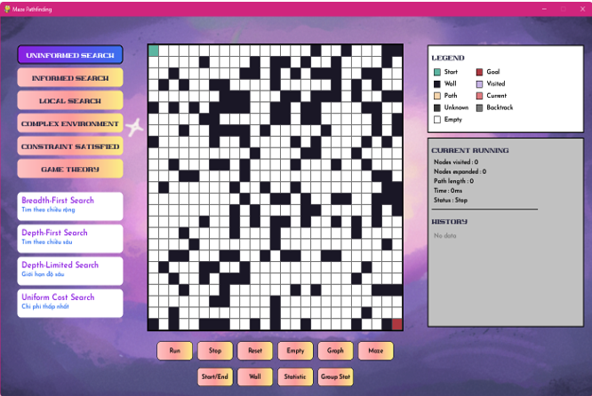
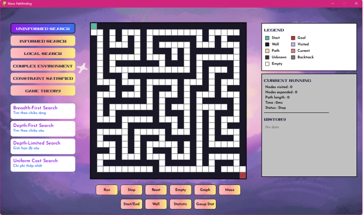

# MAZE GAME
## Thông Tin Đồ Án

**Báo Cáo Cuối Kỳ - Môn: Trí Tuệ Nhân Tạo**

**GVHD:** TS. Phan Thị Huyền Trang

| STT | Sinh viên thực hiện | MSSV |
|-----|---------------------|------|
| 1 | Lương Quang Lâm | 23110121 |
| 2 | Nguyễn Trường Minh | 23110125 |
| 3 | Nguyễn Lê Đức Tuệ | 23110165 |

---

## Giới Thiệu

Trò chơi được xây dựng nhằm mục đích **đánh giá và so sánh các thuật toán tìm kiếm** thuộc 6 nhóm thuật toán chính trong Trí Tuệ Nhân Tạo:

1. **Tìm kiếm không có thông tin** (Uninformed Search)
2. **Tìm kiếm có thông tin** (Informed Search)
3. **Tìm kiếm local search** (Local Search)
4. **Tìm kiếm trong môi trường phức tạp** (Complex Environment)
5. **Tìm kiếm thỏa mãn ràng buộc** (Constraint Satisfaction)
6. **Tìm kiếm đối kháng** (Adversarial Search)

---

## Phân Tích PEAS

### **Performance (Hiệu năng)**
- Tìm kiếm đường đến kho báu **nhanh nhất**
- Số bước đi và thời gian **ít nhất** có thể
- Tránh các vật cản trong quá trình tìm kiếm

### **Environment (Môi trường)**
- Lưu bản đồ bằng **ma trận**
- Bao gồm: tường , start node , goal node 
- **Loại môi trường:**
  - Môi trường có thể quan sát
  - Môi trường tĩnh
  - Môi trường rời rạc
  - Môi trường xác định
  - Môi trường quan sát toàn phần

### **Actuators (Bộ chấp hành)**
- Di chuyển sang **trái, phải, lên, xuống**

### **Sensors (Bộ cảm biến)**
- Vị trí xuất phát
- Vị trí goal
- 4 hướng di chuyển: vật cản hay ô có thể di chuyển được

---

## Các Nhóm Thuật Toán

### **Nhóm 1: Tìm Kiếm Không Có Thông Tin**

#### **Breadth-First Search (BFS)**

Thuật toán tìm kiếm theo chiều rộng sử dụng cấu trúc **Queue** để lưu trữ các trạng thái sinh ra. Queue hoạt động theo cơ chế **FIFO** (First In First Out).

**Đặc điểm:**
- Duyệt hết các lá ở cùng mức trước, sau đó mới đến các mức sâu hơn
- Nếu môi trường trạng thái con sinh nhiều thì độ rộng sẽ rất dài
- Khá tốn không gian lưu trữ

**Độ phức tạp:**
- Thời gian: O(b^d)
- Không gian: O(b^d)

**Hình ảnh (.gif) minh họa thuật toán:**


---

#### **Depth-First Search (DFS)**

Thuật toán tìm kiếm theo chiều sâu sử dụng cấu trúc **Stack** hoạt động theo cơ chế **LIFO** (Last In First Out).

**Đặc điểm:**
- Tối ưu khi kho báu nằm ở một nhánh cụ thể
- Tốn thời gian khi duyệt độ sâu vô hạn
- Tối ưu không gian hơn BFS

**Độ phức tạp:**
- Thời gian: O(b^d) (trường hợp xấu nhất)
- Không gian: O(b·d)

**Hình ảnh (.gif) minh họa thuật toán:**


---

#### **Depth-Limited Search (DLS)**

Thuật toán **DLS** là biến thể của DFS nhưng có giới hạn độ sâu tìm kiếm. Thuật toán chỉ duyệt đến độ sâu tối đa được định trước.

**Đặc điểm:**
- Giải quyết vấn đề duyệt vô hạn của DFS
- Có thể không tìm thấy đường đi nếu goal nằm quá sâu
- Tốn ít không gian hơn BFS
- Phù hợp khi biết trước độ sâu tối ưu

**Độ phức tạp:**
- Thời gian: O(b^l) với l là depth limit
- Không gian: O(b·l)

**Hình ảnh (.gif) minh họa thuật toán:**


---

#### **Uniform Cost Search (UCS)**

Thuật toán **UCS** là mở rộng của BFS, chọn node có tổng chi phí đường đi thấp nhất từ điểm xuất phát.

**Đặc điểm:**
- Sử dụng Priority Queue theo chi phí thực tế g(n)
- Đảm bảo tìm được đường đi có chi phí thấp nhất
- Tương đương BFS khi tất cả bước đi có chi phí bằng nhau
- Tốn không gian nhiều hơn DFS

**Độ phức tạp:**
- Thời gian: O(b^(C*/ε)) với C* là chi phí tối ưu
- Không gian: O(b^(C*/ε))

**Hình ảnh (.gif) minh họa thuật toán:**


---

#### **Bảng Đánh Giá Thuật Toán với Map Graph **

| Thuật toán | Thời gian | Số bước đi |
|------------|-----------|------------|
| **Breadth-First Search** | 12222ms | 49 |
| **Depth-First Search** | 1969ms | 57 |
| **Depth-Limited Search** | 9920ms | 223 |
| **Uniform Cost Search** | 12178ms | 49 |

#### **Bảng Đánh Giá Thuật Toán với Map Maze **
| Thuật toán | Thời gian | Số bước đi |
|------------|-----------|------------|
| **Breadth-First Search** | 6846ms | 129 |
| **Depth-First Search** | 3885ms | 129 |
| **Depth-Limited Search** | 3885ms | 129 |
| **Uniform Cost Search** | 6883ms | 129 |
---

### **Nhóm 2: Tìm Kiếm Có Thông Tin**

#### **Greedy Best-First Search**

Thuật toán Greedy sử dụng cấu trúc lưu trữ **Priority Queue**. Chọn đường đi có chi phí ước lượng thấp nhất.

**Hàm đánh giá:**
- Sử dụng hàm **h(n)** (Heuristics) để ước lượng chi phí từ vị trí hiện tại đến kho báu
- h(n) được tính dựa trên khoảng cách Manhattan

**Đặc điểm:**
- Muốn tối ưu phải ước lượng chi phí chính xác
- Nếu ước lượng sai có thể tìm ra đường đi không tối ưu

**Hình ảnh (.gif) minh họa thuật toán:**


---

#### **A\* Search**

Thuật toán A* sử dụng cấu trúc lưu trữ **Priority Queue**. Chọn hướng đi có chi phí thấp nhất.

**Hàm đánh giá:**
```
f(n) = g(n) + h(n)
```
Trong đó:
- **f(n)**: Tổng chi phí
- **g(n)**: Chi phí từ vị trí xuất phát đến vị trí hiện tại (Path Cost)
- **h(n)**: Ước lượng chi phí từ vị trí hiện tại đến kho báu (Heuristics)

**Hình ảnh (.gif) minh họa thuật toán:**


---

#### **Bảng Đánh Giá Thuật Toán Map Graph**

| Thuật toán | Thời gian | Số bước đi |
|------------|-----------|------------|
| **Greedy Best-First Search** | 1942ms | 57 |
| **A\* Search** | 7945ms | 49 |

#### **Bảng Đánh Giá Thuật Toán Map Maze**

| Thuật toán | Thời gian | Số bước đi |
|------------|-----------|------------|
| **Greedy Best-First Search** | 3865ms | 129 |
| **A\* Search** | 4671ms | 129 |
---

### **Nhóm 3: Tìm Kiếm Cục Bộ**

#### **Simulated Annealing**

Thuật toán **Simulated Annealing (SA)** là phương pháp tìm kiếm ngẫu nhiên được lấy cảm hứng từ quá trình tôi luyện kim loại (annealing) trong vật lý.

**Nguyên lý:**
- Khi nung nóng kim loại rồi làm nguội dần, các nguyên tử có xu hướng sắp xếp lại để đạt được cấu trúc năng lượng thấp nhất
- Trong bài toán này, SA được sử dụng để tìm đường đi từ vị trí xuất phát đến kho báu trên bản đồ mê cung

**Hình ảnh (.gif) minh họa thuật toán:**


---

#### **Hill Climbing**

Thuật toán **Hill Climbing** là phương pháp tìm kiếm cục bộ, luôn chọn bước đi tốt nhất về phía mục tiêu.

**Nguyên lý:**
- Chỉ xem xét các trạng thái lân cận
- Chọn neighbor có heuristic tốt nhất
- Dừng khi không còn neighbor nào tốt hơn
- Dễ rơi vào local optimum

**Đặc điểm:**
- Rất nhanh và tiết kiệm bộ nhớ
- Không đảm bảo tìm được lời giải tối ưu
- Có thể bị mắc kẹt tại đỉnh cục bộ
- Phù hợp với bài toán có không gian trạng thái đơn giản

**Hình ảnh (.gif) minh họa thuật toán:**


---

#### **Beam Search**

Thuật toán **Beam Search** giữ lại k trạng thái tốt nhất ở mỗi mức, kết hợp ưu điểm của BFS và heuristic search.

**Nguyên lý:**
- Giới hạn số lượng node được mở rộng ở mỗi mức (beam width)
- Chỉ giữ lại k node có heuristic tốt nhất
- Giảm không gian lưu trữ so với BFS thông thường
- Trade-off giữa tính tối ưu và hiệu suất

**Đặc điểm:**
- Hiệu quả về mặt không gian
- Không đảm bảo tìm được lời giải tối ưu
- Beam width nhỏ: nhanh nhưng có thể bỏ lỡ lời giải
- Beam width lớn: chậm hơn nhưng tăng khả năng tìm được lời giải tốt

**Hình ảnh (.gif) minh họa thuật toán:**


---

#### **Bảng Đánh Giá Thuật Toán Map Graph**

| Thuật toán | Thời gian | Số bước đi |
|------------|-----------|------------|
| **Hill Climbing** | 449ms | 0 |
| **Simulated Annealing** | 446ms| 0 |
| **Beam Search** | 2560ms | 55 |


#### **Bảng Đánh Giá Thuật Toán Map Maze**

| Thuật toán | Thời gian | Số bước đi |
|------------|-----------|------------|
| **Hill Climbing** | 357ms | 0 |
| **Simulated Annealing** | 1680ms | 0 |
| **Beam Search** | 5177ms | 129 |

---

### **Nhóm 4: Tìm Kiếm Trong Môi Trường Phức Tạp**

#### **AND-OR Tree Search**

Thuật toán **AND-OR Tree Search** là dạng mở rộng của tìm kiếm theo cây (Tree Search) dùng để giải quyết bài toán có nhiều khả năng hoặc điều kiện rẽ nhánh.

**Đặc điểm:**
- Một số hành động có thể dẫn đến nhiều trạng thái con (**AND nodes**)
- Từ mỗi trạng thái có thể có nhiều lựa chọn hành động khác nhau (**OR nodes**)
- Mỗi ô là một trạng thái
- Việc di chuyển đến các ô kề là các hành động khả thi

**Hình ảnh (.gif) minh họa thuật toán:**


---

#### **Tìm Kiếm Trong Môi Trường Nhìn Thấy Một Phần**

Thuật toán tìm kiếm trong **môi trường quan sát một phần** (Partially Observable Environment), agent chỉ nhìn thấy một phần trạng thái môi trường.

**Cách hoạt động:**
- Agent chỉ quan sát được vùng lân cận
- Xây dựng belief state dựa trên quan sát từng phần
- Sử dụng Greedy để tìm đến vị trí trung gian đã biết trước
- Từ vị trí đó tiếp tục tìm đến goal

**Đặc điểm:**
- Giảm không gian tìm kiếm so với unobservable
- Tối ưu hơn khi biết trước một số vị trí quan trọng
- Cần cân bằng giữa exploration và exploitation

**Hình ảnh (.gif) minh họa thuật toán:**


---

#### **Bảng Đánh Giá Thuật Toán Map Graph**

| Thuật toán | Thời gian | Số bước đi |
|------------|-----------|------------|
| **AND-OR Tree** | 6821ms | 130 |
| **Partially Observable** | 8376ms | 129 |
| **Unobservable Search** | 8366ms | 130 |

#### **Bảng Đánh Giá Thuật Toán Map Maze**

| Thuật toán | Thời gian | Số bước đi |
|------------|-----------|------------|
| **AND-OR Tree** | 12193ms | 50 |
| **Partially Observable** | 9931ms | 223 |
| **Unobservable Search** | 9930ms | 224 |

---

### **Nhóm 5: Tìm Kiếm Thỏa Mãn Ràng Buộc**

#### **CSP Backtracking**

Thuật toán **CSP Backtracking** (Constraint Satisfaction Problem) được sử dụng để giải bài toán tìm đường trong mê cung dựa trên việc thỏa mãn các ràng buộc giữa các biến (các ô của bản đồ).

**Nguyên tắc hoạt động:**
- **Thử - sai** (trial and error)
- Kiểm tra tính hợp lệ (consistency)
- Loại bỏ các đường đi không thỏa mãn trước khi tiếp tục mở rộng tìm kiếm

**Hình ảnh (.gif) minh họa thuật toán:**


---

#### **Forward Checking**

Thuật toán **Forward Checking** là cải tiến của Backtracking, kiểm tra tính hợp lệ trước khi gán giá trị.

**Nguyên lý:**
- Sau mỗi lần gán biến, kiểm tra domain của các biến chưa gán
- Loại bỏ các giá trị không thỏa mãn ràng buộc với biến vừa gán
- Phát hiện sớm các nhánh không có lời giải
- Giảm số lần backtrack so với Backtracking thuần túy

**Ưu điểm:**
- Hiệu quả hơn Backtracking thông thường
- Phát hiện sớm inconsistency
- Giảm số node cần khám phá

**Hình ảnh (.gif) minh họa thuật toán:**


---

#### **Bảng Đánh Giá Thuật Toán Map Graph**

| Thuật toán | Thời gian | Số bước đi |
|------------|-----------|------------|
| **Backtracking** | 2123ms | 58 |
| **Forward Checking** | 624ms | 57 |
| **AC3** | 3655ms | 57 |

#### **Bảng Đánh Giá Thuật Toán Map Maze**

| Thuật toán | Thời gian | Số bước đi |
|------------|-----------|------------|
| **Backtracking** | 3973ms | 130 |
| **Forward Checking** | 1178ms | 129 |
| **AC3** | 2815ms | 129 |

---

### **Nhóm 6: Tìm Kiếm Đối Kháng**

#### **Minimax**

Thuật toán **MiniMax** là kỹ thuật tìm kiếm thường được áp dụng trong các trò chơi đối kháng (như cờ vua, cờ caro, hoặc bài toán đường đi có chướng ngại).

**Nguyên lý hoạt động:**
- **Người chơi (MAX):** Cố gắng tối đa hóa điểm số (giá trị heuristic)
- **Đối thủ (MIN):** Cố gắng tối thiểu hóa điểm số (làm cho người chơi thua)
- MiniMax duyệt qua toàn bộ cây trạng thái đến độ sâu xác định (depth)
- Đánh giá nước đi nào mang lại kết quả tốt nhất trong tình huống xấu nhất

**Trong bài toán tìm kho báu:**
- **Người chơi là MAX:** Muốn đi gần đến kho báu
- **Môi trường (đối thủ) là MIN:** Khiến người chơi đi xa hơn hoặc bị kẹt

**Hình ảnh (.gif) minh họa thuật toán:**


---


---

## Phân Tích, Đánh Giá

### **Map Graph**



Ma trận (Graph) này được thiết kế với cấu trúc với đường đi thoáng và nhiều đường đi khác nhau giúp việc minh họa thuật toán trở nên cực kỳ trực quan. Điều này làm nổi bật rõ ràng sự khác biệt trong chiến lược tìm kiếm.

#### **Giữa các thuật toán**

##### **Nhóm Uninformed Search**

Cả bốn thuật toán đều tìm được lời giải, nhưng hiệu năng cho thấy sự khác biệt rõ rệt về chiến lược tìm kiếm:

**Chiến lược Depth-First (DFS & DLS)**

**DLS** là thuật toán thể hiện sự vượt trội hơn hẳn so với các thuật toán còn lại trong nhóm, chứng tỏ việc áp dụng một giới hạn độ sâu hợp lý đã cắt tỉa không gian tìm kiếm hiệu quả và góp phần tối ưu hơn.

Ngược lại, **DFS** không có giới hạn đã trở thành thuật toán kém hiệu quả nhất, cho thấy nó đã lãng phí tài nguyên khi đi quá sâu vào những nhánh không tối ưu, dẫn đến tìm được lời giải quá xa so với lời giải tối ưu.

**Chiến lược Breadth-First (BFS & UCS)**

**BFS** và **UCS** cho kết quả gần như tương đồng với nhau, gợi ý mạnh mẽ rằng bài toán có chi phí mỗi bước đi là đồng nhất. Trong trường hợp này, UCS không phát huy được thế mạnh về chi phí và hoạt động như BFS. Đồng thời, cả hai thuật toán này đều tốn kém nhiều tài nguyên để mở rộng, vì vậy thời gian thực thi chậm hơn các thuật toán khác.

**Kết luận:** Hiệu năng của nhóm này chỉ ở mức trung bình, cho thấy việc phải duyệt toàn bộ các node ở mỗi tầng là tốn kém hơn so với chiến lược cắt tỉa hiệu quả của DLS.

##### **Nhóm Informed Search**

Cả hai thuật toán này đều sử dụng hàm ước lượng (heuristic) để tìm kiếm một cách "thông minh", giúp định hướng đường đi và tăng hiệu quả rõ rệt.

**Greedy Best-First Search (GBF)**

- **Chiến lược:** Hoàn toàn "tham lam", chỉ dựa vào hàm heuristic để phán đoán. Nó luôn ưu tiên đi về phía node mà nó nghĩ là gần đích nhất, bất chấp quãng đường đã đi.
- **Kết quả:** Nhờ chiến lược này, GBF thường cực kỳ nhanh trong việc tìm ra một lời giải. Tuy nhiên, nó cũng có một nhược điểm lớn là không đảm bảo tìm được lời giải tối ưu nhất vì có thể bị "đánh lừa" bởi heuristic.

**A* (A-star)**

- **Chiến lược:** Thuật toán này có thể xem là thận trọng và cân bằng hơn. Nó kết hợp cả chi phí quãng đường đã đi và chi phí ước lượng còn lại để ra quyết định.
- **Kết quả:** A* thường chậm hơn GBF vì phải tính toán và cân nhắc nhiều yếu tố hơn. Dù cho vậy nhưng A* vẫn sẽ luôn đảm bảo tìm được đường đi ngắn nhất (tối ưu nhất).

##### **Nhóm Local Search**

Nhóm này hoạt động bằng cách bắt đầu từ một trạng thái và liên tục thực hiện các cải tiến nhỏ để tìm lời giải. Tuy nhiên, hiệu quả của chúng rất khác nhau.

**Hill Climbing & Simulated Annealing (SA)**

Cả hai thuật toán đều thất bại và dừng lại rất sớm.

Đây là hiện tượng kinh điển của tìm kiếm cục bộ. Rất có khả năng cả hai thuật toán đã bị "mắc kẹt" tại một điểm tối ưu cục bộ (local optimum) hoặc một vùng "bằng phẳng" (plateau), nơi mà mọi nước đi tiếp theo đều không dẫn đến trạng thái tốt hơn. Dù Simulated Annealing được thiết kế để có thể "nhảy" ra khỏi các điểm kẹt này, nhưng trong lần chạy này, nó đã không thành công và hoạt động y hệt như Hill Climbing.

**Beam Search**

Thuật toán thành công tìm ra lời giải.

Beam Search đã khắc phục được nhược điểm của hai thuật toán trên. Thay vì chỉ giữ lại một trạng thái tốt nhất duy nhất, nó duy trì một "chùm" (beam) gồm k trạng thái tốt nhất ở mỗi bước. Bằng cách khám phá đồng thời nhiều đường đi hứa hẹn, nó đã tránh được việc bị mắc kẹt sớm và tìm được đường đến mục tiêu.

**Kết luận:** Đối với không gian tìm kiếm của bài toán này, các thuật toán Local Search đơn giản như Hill Climbing và Simulated Annealing tỏ ra không đáng tin cậy vì chúng dễ bị mắc kẹt. Ngược lại, Beam Search chứng tỏ sự mạnh mẽ hơn hẳn nhờ chiến lược duy trì nhiều lựa chọn, tạo ra sự cân bằng tốt giữa việc khám phá và tiết kiệm tài nguyên.

##### **Nhóm Complex Environment**

Nhóm thuật toán này hỗ trợ giải quyết các bài toán phức tạp hơn, nơi agent không có đầy đủ thông tin về môi trường hoặc về kết quả của hành động.

**Partial Observable & Unobservable Search**

Cả hai đều hoạt động trên không gian trạng thái niềm tin (belief state), tức là chúng không theo dõi một trạng thái duy nhất mà là một tập hợp các trạng thái có thể xảy ra.

- **Partial Observable** có thể dùng cảm biến để thu hẹp tập hợp các trạng thái có thể, giúp cắt tỉa bớt không gian tìm kiếm.
- **Unobservable** thì "mù" hoàn toàn, không có thông tin từ cảm biến, nên phải xét mọi khả năng. Điều này lý giải tại sao nó phải mở rộng nhiều trạng thái hơn dù thời gian và số node duyệt tương đương.

**AND-OR Search**

Thuật toán này không tìm một chuỗi hành động duy nhất, mà xây dựng một kế hoạch dự phòng (contingent plan). Kế hoạch này giống như một cây quyết định, có sẵn các nhánh hành động cho mọi tình huống có thể xảy ra.

Việc phải xây dựng một kế hoạch phức tạp bao quát nhiều trường hợp khiến chi phí tính toán (thời gian, số node mở rộng) của AND-OR Search là cao nhất trong tất cả các thuật toán đã xét. Độ dài đường đi (Len) ngắn hơn hẳn có thể là do nó đo lường độ sâu của cây kế hoạch, chứ không phải một chuỗi hành động tuần tự.

**Kết luận:** Partial/Unobservable Search phù hợp khi agent không chắc mình đang ở đâu. Ngược lại, AND-OR Search phù hợp khi agent không chắc hành động của mình sẽ dẫn đến đâu. Chi phí để xây dựng một kế hoạch đối phó với mọi bất trắc (AND-OR) là rất lớn so với việc chỉ đơn thuần tìm một đường đi trong không gian niềm tin.

##### **Nhóm Constraint Satisfied Problem**

Nhóm thuật toán CSP giải quyết vấn đề bằng cách gán giá trị cho các biến sao cho không vi phạm bất kỳ ràng buộc nào. Hiệu quả của chúng phụ thuộc vào cách chúng xử lý và lan truyền các ràng buộc.

**Backtracking Search**

Đây là phương pháp "thử và sai" cơ bản nhất. Nó gán giá trị cho một biến, sau đó chuyển sang biến tiếp theo. Nếu gặp ngõ cụt, nó quay lui (backtrack) và thử một giá trị khác.

Là thuật toán kém hiệu quả nhất trong nhóm. Nó phải duyệt qua nhiều trạng thái không hợp lệ hơn trước khi tìm ra lời giải, dẫn đến chi phí tính toán cao hơn so với các phương pháp thông minh hơn.

**Forward Checking**

Đây là một phiên bản nâng cấp của Backtracking. Mỗi khi gán một giá trị cho biến X, nó ngay lập tức kiểm tra các biến "hàng xóm" (những biến có ràng buộc với X) và loại bỏ những giá trị không còn hợp lệ trong tương lai.

Chiến lược "nhìn trước" này tỏ ra cực kỳ hiệu quả. Bằng cách cắt tỉa sớm các nhánh tìm kiếm vô ích, nó giảm đáng kể số trạng thái cần xét và là thuật toán nhanh nhất trong nhóm.

**AC-3 (Arc Consistency)**

AC-3 không phải là một thuật toán tìm kiếm, mà là một bước tiền xử lý (preprocessing). Nó chạy trước khi tìm kiếm bắt đầu, xem xét tất cả các ràng buộc trong bài toán và loại bỏ mọi giá trị chắc chắn không thể là một phần của lời giải.

**Kết quả:** Trong trường hợp này, việc áp dụng AC-3 tốn rất nhiều thời gian, thậm chí là chậm nhất. Mặc dù nó giúp giảm không gian tìm kiếm (số node bằng với Forward Checking), chi phí để thực hiện việc kiểm tra toàn bộ các ràng buộc ngay từ đầu là quá lớn và không mang lại lợi ích tương xứng so với Forward Checking.

**Kết luận:** Forward Checking là lựa chọn tối ưu nhất trong nhóm thuật toán này, giữ được sự cân bằng hoàn hảo giữa việc cắt tỉa thông minh và chi phí xử lý thấp. Backtracking cơ bản quá đơn giản và không hiệu quả. AC-3, dù mạnh mẽ, nhưng lại tỏ ra là một sự đầu tư "lỗ vốn" cho bài toán này vì chi phí tiền xử lý quá cao.

##### **Thuật toán Minimax (Player vs. Monster)**

Đây là một AI cực kỳ thông minh vì nó không chỉ tìm đường đi mà còn dự đoán tương lai và đảm bảo an toàn.

- **Về góc độ tầm nhìn:** Nó dùng BFS để "nhìn trước" toàn bộ mê cung, giúp nó không bao giờ đi vào ngõ cụt.
- **Về chiến lược phòng thủ:** Nó chơi game với giả định rằng Monster là một thợ săn thông minh và luôn tìm cách di chuyển an toàn nhất để không bị bắt.
- **Đưa ra quyết định tối ưu:** Mọi nước đi đều được cân nhắc kỹ lưỡng giữa việc "tiến đến đích" và "tránh xa quái vật".

Đây là một AI phòng thủ có tính toán, ưu tiên sự an toàn và chắc chắn lên hàng đầu, khiến nó trở nên rất khó bị đánh bại.

#### **Giữa các nhóm thuật toán**

Nhìn vào biểu đồ tổng hợp, ta có thể thấy rõ sự phân hóa về bản chất và độ phức tạp của từng nhóm bài toán.

- **Nhóm hiệu quả nhất (Nhanh, ít node):** Nhóm Informed Search (GBF), Uninformed Search (DLS), và CSP (AC-3/Forward Checking) là những nhóm có hiệu năng tốt nhất. Chúng giải quyết các bài toán có thông tin đầy đủ, rõ ràng, giúp chúng nhanh chóng tìm ra lời giải mà không tốn nhiều tài nguyên.

- **Nhóm phức tạp nhất (Chậm, nhiều node):** Nhóm Complex Environment (Partial Observable) có độ phức tạp cao hơn nhiều so với các nhóm khác. Nó tốn nhiều thời gian và không gian bộ nhớ nhất, cho thấy bản chất của các bài toán mà nó giải quyết (môi trường phức tạp) là khó hơn rất nhiều.

---

### **Map Maze**



Mê cung (Maze) được thiết kế với cấu trúc cổ điển, đặc trưng bởi những đường đi hẹp, quanh co và có nhiều ngõ cụt. Cấu trúc này được xây dựng nhằm tạo ra một thử thách tìm kiếm phức tạp, mô phỏng các bài toán thực tế nơi có nhiều "bẫy" và các lựa chọn sai lầm. Thuật toán có thể dễ dàng bị "lạc" vào một nhánh dài không có lối thoát, qua đó cho thấy sự lãng phí tài nguyên và sự cần thiết của việc quay lui (backtracking) hiệu quả.

#### **Giữa các thuật toán**

##### **Nhóm Uninformed Search**

Một điểm khác biệt lớn so với map Graph là tất cả bốn thuật toán đều tìm ra đường đi có độ dài giống hệt nhau (Len: 129). Cấu trúc hẹp và dài của mê cung đã vô tình "hướng" các thuật toán đi theo một lộ trình duy nhất, khiến chúng không còn nhiều lựa chọn để đi lạc vào các nhánh quá tệ.

**Depth-Limited Search (DLS)**

Giới hạn độ sâu hợp lý đã giúp nó tránh được việc đi vào các ngõ cụt dài, tối ưu hóa đáng kể tài nguyên.

**Depth-First Search (DFS)**

Đúng như thiết kế của map Maze, DFS đã liên tục đi sâu vào các ngõ cụt, dẫn đến việc phải quay lui (backtrack) rất nhiều lần, gây lãng phí tài nguyên và thời gian.

**Breadth-First Search (BFS) & Uniform Cost Search (UCS)**

Cả hai tiếp tục cho kết quả gần như y hệt nhau, duyệt toàn bộ không gian theo từng tầng. Chúng đảm bảo tìm ra lời giải tối ưu nhưng phải trả giá bằng thời gian và tài nguyên duyệt lớn hơn so với DLS.

##### **Nhóm Informed Search**

Việc sử dụng hàm heuristic (ước lượng) trong một mê cung có định hướng rõ ràng đã tỏ ra cực kỳ hiệu quả, giúp cả hai thuật toán hoạt động rất tốt.

**Greedy Best-First Search (GBF)**

GBF là một trong những thuật toán nhanh nhất. Chiến lược "tham lam" chỉ dựa vào heuristic đã phát huy tối đa hiệu quả trong môi trường mê cung, nơi hướng đi đến đích khá rõ ràng.

**A* (A-star)**

Sự cẩn trọng khi kết hợp cả chi phí đã đi và chi phí ước lượng đã tạo ra một chi phí tính toán bổ sung nhỏ. Mặc dù nó luôn đảm bảo tính tối ưu, nhưng trong map Maze này, chiến lược tham lam của GBF tình cờ cũng tìm ra đường đi tối ưu và lại nhanh hơn.

##### **Nhóm Local Search**

Kết quả của nhóm này trên map Maze hoàn toàn tương tự như trên map Graph.

**Hill Climbing & Simulated Annealing (SA)**

Cả hai thuật toán đều thất bại. Cấu trúc ngõ cụt của mê cung chính là ví dụ hoàn hảo cho các điểm cực trị cục bộ. Khi đi vào một ngõ cụt, mọi bước đi tiếp theo đều không cải thiện được tình hình (không đến gần đích hơn), khiến thuật toán bị mắc kẹt và dừng lại.

**Beam Search**

Đây là thuật toán duy nhất thành công trong nhóm khi chạy trong map Maze. Bằng cách luôn duy trì một beam gồm nhiều trạng thái tốt nhất thay vì chỉ chọn một như Hill Climbing và Simulated Anneling, Beam Search đã không bị kẹt ở một ngõ cụt duy nhất. Khi một đường đi trong beam bị kẹt, các đường đi khác vẫn tiếp tục được khám phá, giúp nó tìm được lối ra.

##### **Nhóm Complex Environment**

Với môi trường mê cung phức tạp, đây là một thử thách lớn cho các thuật toán xử lý thông tin không chắc chắn.

**Partial Observable & Unobservable Search**

Cả hai đều tốn rất nhiều thời gian và duyệt nhiều node. Trong một mê cung quanh co, việc xác định vị trí chính xác (belief state) trở nên rất khó, ngay cả khi có cảm biến. Unobservable phải mở rộng nhiều trạng thái hơn vì nó phải xét mọi khả năng mà không có thông tin bổ sung.

**AND-OR Search**

Thuật toán này lại hoạt động hiệu quả hơn trong môi trường này. Lý do là vì mê cung tuy phức tạp về đường đi nhưng lại có tính xác định (hành động đi sang trái luôn dẫn đến ô bên trái). Việc xây dựng một kế hoạch dự phòng (ví dụ như nếu phía trước là tường thì rẽ phải) tỏ ra ít tốn kém hơn so với việc phải duy trì một tập hợp niềm tin khổng lồ về vị trí hiện tại.

##### **Nhóm Constraint Satisfied Problem**

**Forward Checking**

Trong môi trường mê cung, với mật độ các ô tường (không hợp lệ) dày đặc và liên tiếp nhau, đường đi chật hẹp thì Forward Checking hoạt động cực kì hiệu quả, vì có thể nhìn trước nên Forward Checking có thể dễ dàng loại bỏ những bước đi không hợp lệ.

**Backtracking Search**

Là thuật toán chậm nhất trong nhóm. Phương pháp "thử và sai" đơn giản khiến nó liên tục đi vào các ngõ cụt và phải quay lui, lãng phí thời gian.

**AC-3**

Theo lý thuyết AC – 3 phải hiệu quả hơn Backtracking và Forward Checking vì xử lý ràng buộc tối ưu hơn và nhìn trước được nhiều hơn, nhưng khi áp dụng vẫn chậm hơn đáng kể so với Forward Checking. Lý do là chi phí lớn cho việc tiền xử lý toàn bộ các ràng buộc của mê cung một lần nữa không hiệu quả bằng chiến lược cắt tỉa linh hoạt của Forward Checking.

##### **Thuật toán Minimax (Player vs. Monster)**

Ở thuật toán này, Agent phải "suy nghĩ" hợp lý sao cho vừa không bị quái vật bắt và vừa đến được đích, việc thiết lập sự ưu tiên cho cả 2 hành động khá là khó khăn với môi trường mê cung phức tạp vì hầu hết cách tính toán sự ưu tiên đều dự theo khoảng cách, và cả Agent và Monster đều ưu tiên về khoảng cách thì rất dễ dàng rơi vào vòng lặp (hiện tượng đi tới đi lui lặp lại 2 vị trí).

#### **Giữa các nhóm thuật toán**

Nhìn vào biểu đồ tổng hợp về map Maze:

- **Nhóm hiệu quả nhất (Nhanh, ít node):** Các nhóm Informed Search (GBF), Uninformed Search (DLS), và đặc biệt là CSP (Forward Checking/AC-3) tiếp tục chứng tỏ hiệu quả vượt trội. Các chiến lược tìm kiếm có định hướng, có cắt tỉa thông minh tỏ ra rất phù hợp với bài toán có cấu trúc ràng buộc cao như mê cung.

- **Nhóm phức tạp nhất (Chậm, nhiều node):** Nhóm Complex Environment (AND-OR) và Local Search (Beam) yêu cầu nhiều tài nguyên nhất. Điều này cho thấy việc xử lý sự không chắc chắn hoặc khám phá nhiều nhánh song song trong một môi trường phức tạp như mê cung là những bài toán tốn kém hơn hẳn.

---

## Cài Đặt và Chạy Chương Trình

### **Yêu cầu hệ thống**
- Python 3.8 trở lên
- Pygame
- Matplotlib
- Pillow (PIL)
- Tkinter

### **Cài đặt thư viện**

```bash
pip install pygame matplotlib pillow
```

### **Chạy chương trình**

```bash
cd maze-game
python main.py
```

---

## Cấu Trúc Dự Án

```
maze-game/
├── main.py                      # File chính để chạy game
├── title_screen.py              # Màn hình tiêu đề
├── MapSelectionScreen.py        # Màn hình chọn map
├── algorithms/                  # Thư mục chứa các thuật toán
│   ├── bfs.py                  # Breadth-First Search
│   ├── dfs.py                  # Depth-First Search
│   ├── astar.py                # A* Search
│   ├── gbf.py                  # Greedy Best-First
│   ├── ucs.py                  # Uniform Cost Search
│   ├── sa.py                   # Simulated Annealing
│   ├── hillclimbing.py         # Hill Climbing
│   ├── beam.py                 # Beam Search
│   ├── and_or_search.py        # AND-OR Tree Search
│   ├── partial_observable.py   # Partially Observable
│   ├── unobservable.py         # Unobservable Search
│   ├── backtracking.py         # CSP Backtracking
│   ├── forward_checking.py     # Forward Checking
│   ├── AC3.py                  # Arc Consistency 3
│   ├── minimax.py              # Minimax Algorithm
│   └── heuristic.py            # Heuristic functions
├── core/                        # Core game logic
│   ├── maze_generator.py       # Sinh bản đồ
│   └── path_finding.py         # Xử lý đường đi
├── ui/                          # Giao diện người dùng
│   ├── game.py                 # Game logic chính
│   └── renderer.py             # Render đồ họa
├── utils/                       # Utilities
│   └── algorithm_runner.py     # Chạy thuật toán
└── assets/                      # Tài nguyên
    ├── fonts/                  # Font chữ
    └── pics/                   # Hình ảnh
```

---

## Hướng Dẫn Sử Dụng

1. **Chọn thuật toán** từ danh sách bên trái
2. **Tùy chỉnh bản đồ:**
   - Generate New Maze: Tạo mê cung mới
   - Beautiful Maze: Tạo mê cung đẹp hơn
   - Set Start/End: Đặt điểm bắt đầu/kết thúc
3. **Chạy thuật toán:** Nhấn nút "Run"
4. **Xem kết quả:** Quan sát đường đi, thời gian và số bước
5. **So sánh:** Chạy nhiều thuật toán và xem biểu đồ so sánh

---

## Kết Luận

Dự án **"Xây dựng Maze Game, ứng dụng các thuật toán tìm đường"** đã hoàn thành các mục tiêu đề ra, xây dựng thành công một ứng dụng trực quan cho phép mô phỏng, so sánh và đánh giá hiệu năng của 6 nhóm thuật toán tìm kiếm phổ biến trong Trí tuệ nhân tạo. Thông qua việc triển khai trên hai loại bản đồ với đặc tính khác nhau là **"Map Graph"** (không gian mở) và **"Map Maze"** (hành lang hẹp, nhiều ngõ cụt), dự án đã mang lại những kết quả giá trị, cho thấy hiệu quả của mỗi thuật toán không chỉ phụ thuộc vào lý thuyết mà còn bị ảnh hưởng sâu sắc bởi cấu trúc của không gian tìm kiếm.

Các thuật toán thuộc nhóm **Tìm kiếm có thông tin (Informed Search)** nhờ khả năng định hướng tìm kiếm bằng các hàm tính toán và ước lượng chi phí nên có hiệu quả vượt trội hơn các nhóm khác. Qua dự án ta có thể thấy tầm quan trọng của việc sử dụng các thông tin bổ trợ để tối ưu hóa quá trình tìm đường trong các bài toán có cấu trúc rõ ràng. Hơn hết, sự cắt tỉa thông minh cũng là một yếu tố quan trọng, giúp tránh những nhánh xấu nhờ khả năng "nhìn trước". Với các thuật toán thuộc nhóm **Tìm kiếm cục bộ (Local Search)** như Hill Climbing và Simulated Annealing rất dễ thất bại vì dễ kẹt tại các "cực tiểu cục bộ" (ngõ cụt). Chỉ có Beam Search, với khả năng duy trì nhiều lựa chọn song song, mới khắc phục được nhược điểm này, cho thấy sự cân bằng giữa khám phá và hiệu quả là yếu tố then chốt. Các thuật toán xử lý **môi trường phức tạp (Complex Environment)** đòi hỏi chi phí tính toán cao nhất, phản ánh độ khó của bài toán khi agent thiếu thông tin về vị trí hoặc kết quả của hành động.

Thông qua việc trực quan hóa quá trình hoạt động và phân tích các số liệu đo đạc được như thời gian thực thi, độ dài đường đi và số nút đã duyệt, dự án không chỉ giúp củng cố kiến thức lý thuyết về các thuật toán AI mà còn mang đến cái nhìn thực tiễn về ưu và nhược điểm của chúng khi áp dụng vào một bài toán cụ thể. Sản phẩm cuối cùng là một công cụ học tập hữu ích, cho phép người dùng tự mình trải nghiệm và khám phá sự khác biệt trong "tư duy" của từng thuật toán một cách sinh động và dễ hiểu.

---

## Đóng Góp

Dự án được phát triển bởi:
- **Lương Quang Lâm** - 23110121
- **Nguyễn Trường Minh** - 23110125
- **Nguyễn Lê Đức Tuệ** - 23110165

Dưới sự hướng dẫn của: **TS. Phan Thị Huyền Trang**

---

**© 2025 - MAZE**
